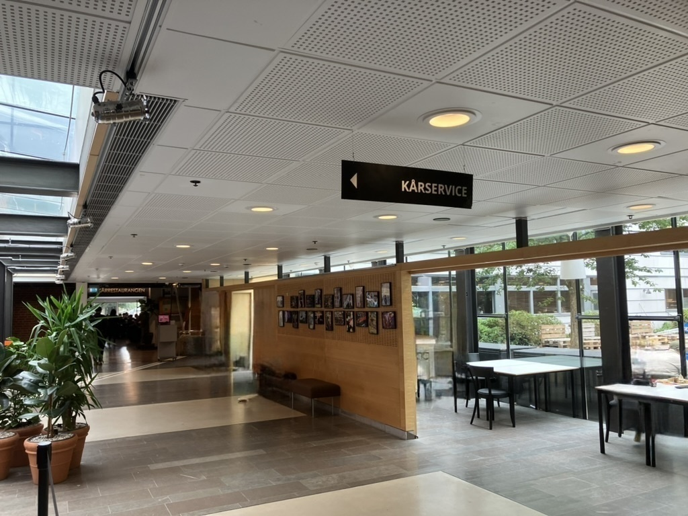
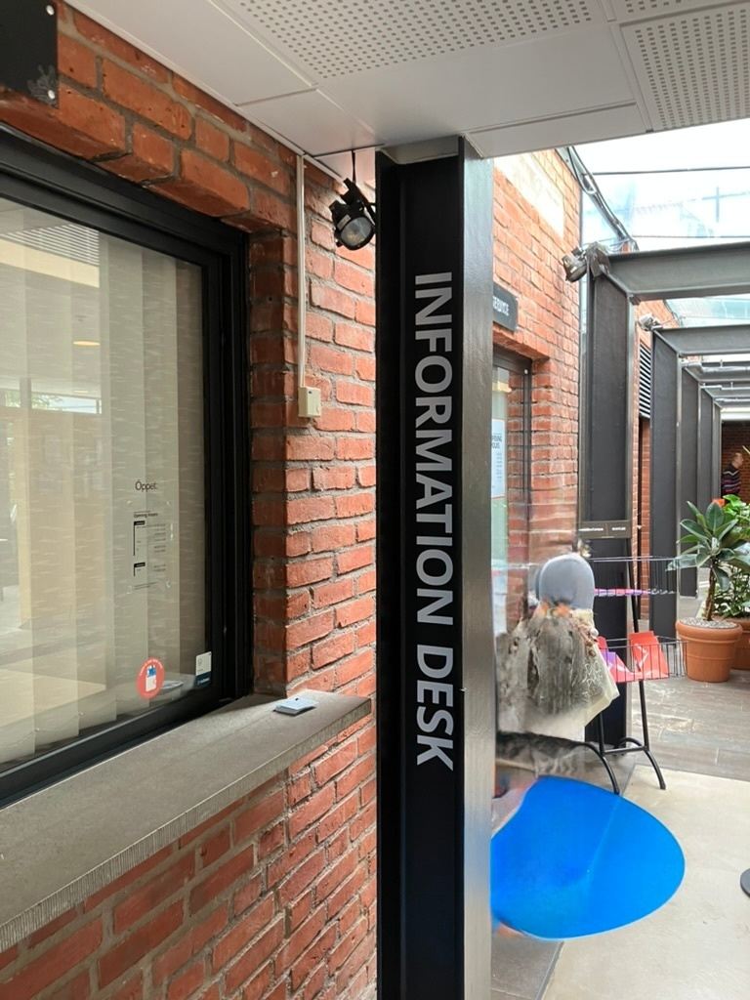

+++
title = "Update personal identity number information in Chalmers"
description = ""
date = 2023-09-07T22:00:25.886Z
updated =2023-09-07T22:00:25.886Z
draft = false
weight = 10
sort_by = "weight"
template = "docs/page.html"

[extra]
lead = 'How to update your personal identity number information in Chalmers'
toc = true
top = false
+++

# Update personal identity number information in Chalmers studentkår

You may go to the studentkår office to update your personal identity number information, it is on the first floor of the student union building.

You need to bring:

- your passport
- an official document which shows identity number, the letter from Skatteverket is fine

# Update personal identity number information in Ladok

You can follow the steps [here](https://www.chalmers.se/en/education/your-studies/plan-and-conduct-your-studies/update-your-contact-information/#update-name-andor-temporary-personal-identity-number).
