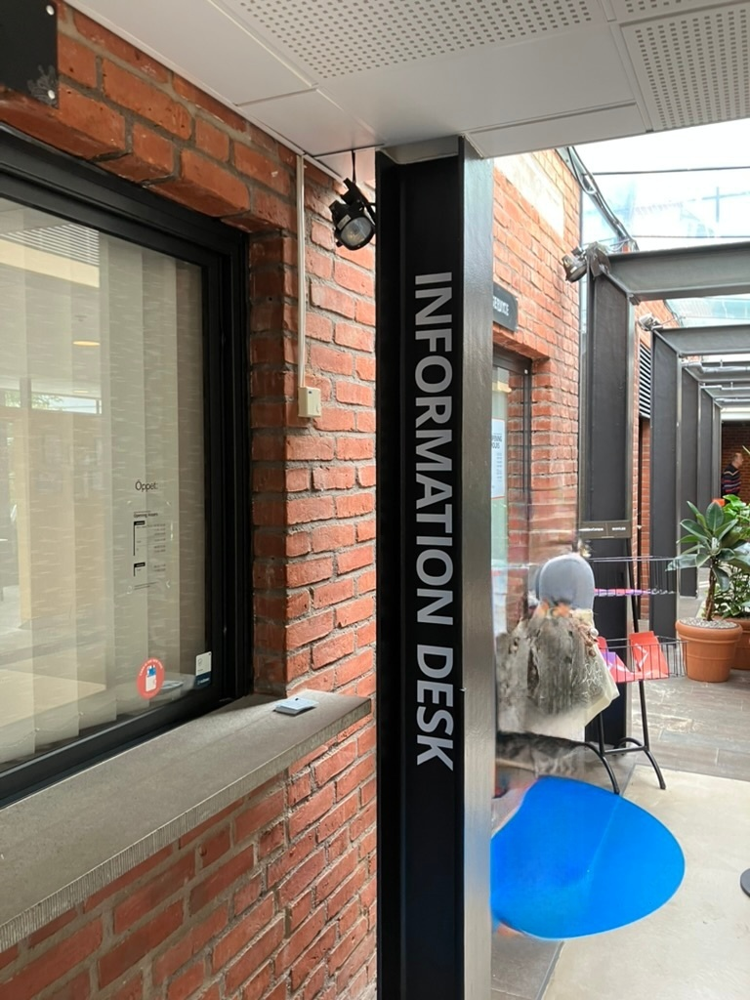

+++
title = "在 Chalmers 的各系统中更新人口号信息"
description = ""
date = 2023-09-07T22:00:25.886Z
updated =2023-09-07T22:00:25.886Z
draft = false
weight = 10
sort_by = "weight"
template = "docs/page.html"

[extra]
lead = '如何在 Chalmers 的各个系统中更新人口号信息。'
toc = true
top = false
+++

# 在 Chalmers 学生会更新人口号信息

你可以去学生会办公室更新你的人口号信息，它位于学生会大楼的一楼。

你需要带上：

- 你的护照
- 一份官方文件，上面有你的人口号，来自税务局的通知你人口号办好了的信件就可以

# 在 Ladok 中更新人口号信息

你可以按照[这里](https://www.chalmers.se/en/education/your-studies/plan-and-conduct-your-studies/update-your-contact-information/#update-name-andor-temporary-personal-identity-number)的步骤更新你的人口号信息。
