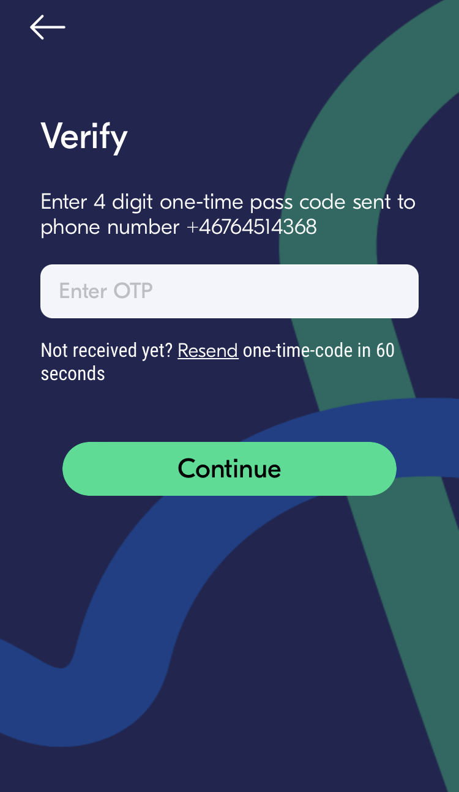

+++
title = "CIRC 提供的 SIM 卡"
description = ""
date = 2023-08-25T12:18:34.718Z
updated = 2023-08-25T12:18:34.718Z
draft = false
weight = 10
sort_by = "weight"
template = "docs/page.html"

[extra]
lead = '如何使用 CIRC 提供给我们的 SIM 卡。'
toc = true
top = false
+++

## SIM Card

CIRC 会提供给我们免费的 SIM 卡。

### 如何激活

访问 [lycamobile website](https://www.lycamobile.se/en/)， 点击 "SIM Registration".

点击 "Register".

.

点击 "Photo ID".

根据要求填好所有信息，然后提交。

随后您的 SIM 卡应该已经激活成功了，您可以登录 lyca app 来检查一下。

如果您收不到 OTP code，您可能需要自己充点钱。

在 [lycamobile 网站](https://www.lycamobile.se/en/)上， 点击 "Quick top up".

.

输入您的手机号，选择您需要充值的金额。 (50kr 足够了，如果您不想一直用这张卡的话)

您不需要添加 bundle，CIRC 已经给您了一个预付费的 bundle。

如果您非常不幸，充值后仍然无法使用，或者打开 App 后发现 bundle 不存在，请联系 CIRC。

### 网络设置

对于部分机型，如上设置后可能还是无法使用，您可能需要手动设置网络。

请参考[这些指令](https://www.lycamobile.se/en/help/mobile-web-settings/)来设置您的网络。
