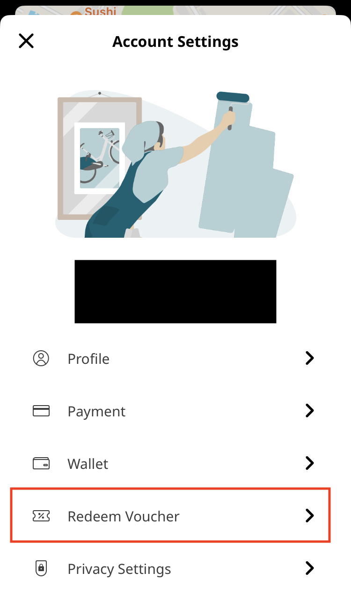
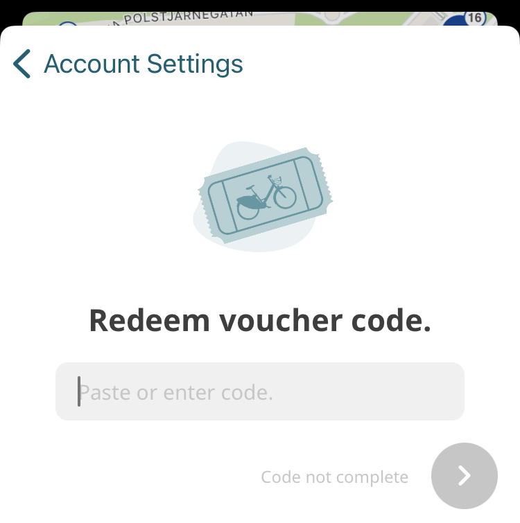

+++
title = "Shared bicycle"
description = "This page tells you how to rent a shared bicycle."
date = 2023-08-25T14:09:14.183Z
updated = 2023-08-25T14:09:14.183Z
draft = false
weight = 10
sort_by = "weight"
template = "docs/page.html"
+++

Note: In Sweden, wearing a helmet when riding a bicycle is only mandatory up to the age of 15. However, it is always the safest choice to wear a helmet even if it’s not mandatory.

You can rent a shared bicycle by using [Styr & Ställ](https://styrochstall.se/sv/).

Register needs a Sweden phone number.

After registration, you can use the app to rent a bicycle.

## Student discount

If you have registered on mecenant, you can get a student discount for a year's rent.

Just search for "Styr & Ställ" on mecenant. You will find the discount code.

Copy the code and paste it into the app.

Then you can rent a bicycle for a year, with 225kr paid.
