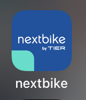
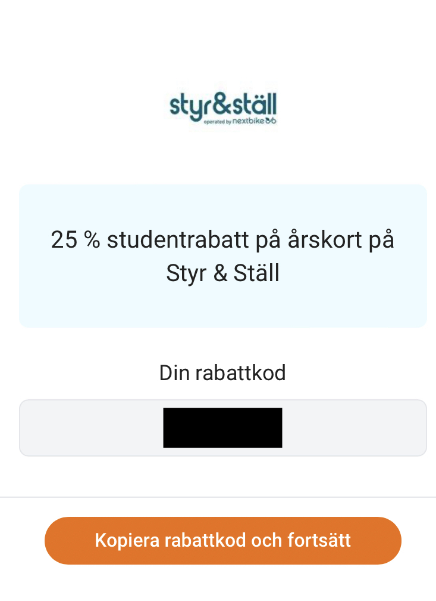
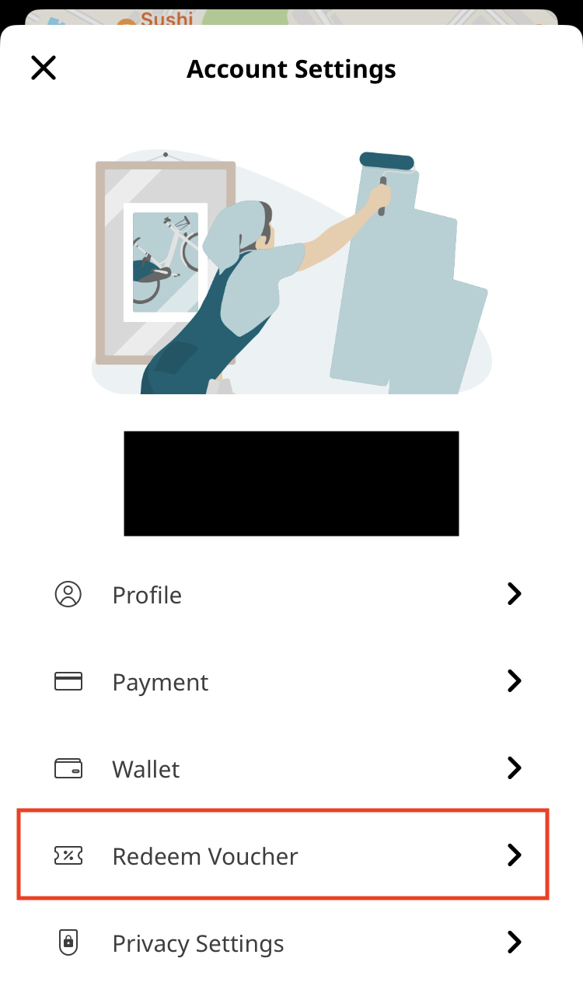

+++
title = "共享单车"
description = "这个页面告诉您如何使用哥德堡的共享单车"
date = 2023-08-28T19:00:37.725Z
updated = 2023-08-28T19:00:37.725Z
draft = false
weight = 10
sort_by = "weight"
template = "docs/page.html"
+++

注意：在瑞典，只有 15 岁以下或骑行速度高于 30 公里/小时时才强制要求佩戴头盔。 但作者推荐您一直带好头盔。

您可以在 [Styr & Ställ](https://styrochstall.se/sv/) 上租公用自行车。

如果您的手机号不受支持，可以尝试使用[CIRC 提供的 SIM 卡](@/docs/phone/circ-sim/index.md)。

注册后您可以使用 app 来租车。

## 学生优惠

如果您在 mecenant 上注册了，您可以获得一年的学生优惠。

在 mecenant 上搜索 "Styr & Ställ"，您会找到优惠码。

Copy the code and paste it into the app.

将其复制到 Styr & Ställ app 中。

然后您就可以用 225kr 租一年的自行车了。
