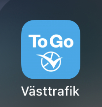

+++
title = "Public transportation ticket"
description = "This page tells you how to get your public transportation ticket."
date = 2023-08-25T12:59:02.797Z
updated = 2023-08-25T12:59:02.797Z
draft = false
weight = 10
sort_by = "weight"
template = "docs/page.html"
+++

You'll need an app named "Västtrafik To Go" to buy your ticket.

You can buy tickets on the second page.

There is one time ticket, one day ticket and one month ticket.

For the one month ticket, if you have done with verifing your student status, you can buy student ticket.

Hint: You'll need to buy a ticket for whole day, "Fritid" ticket is not for students.

## Zones

If you just want to take the bus around the campus, around the city center, go to IKEA, to the supermarkets, etc, you'll only need to buy a ticket for zone A.

An exception is that if you want to go to the airport, you'll need to buy a ticket which includes zone B.

You can always check the zones [here](https://www.vasttrafik.se/reseplanering/hallplatser/).
