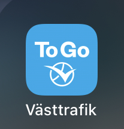
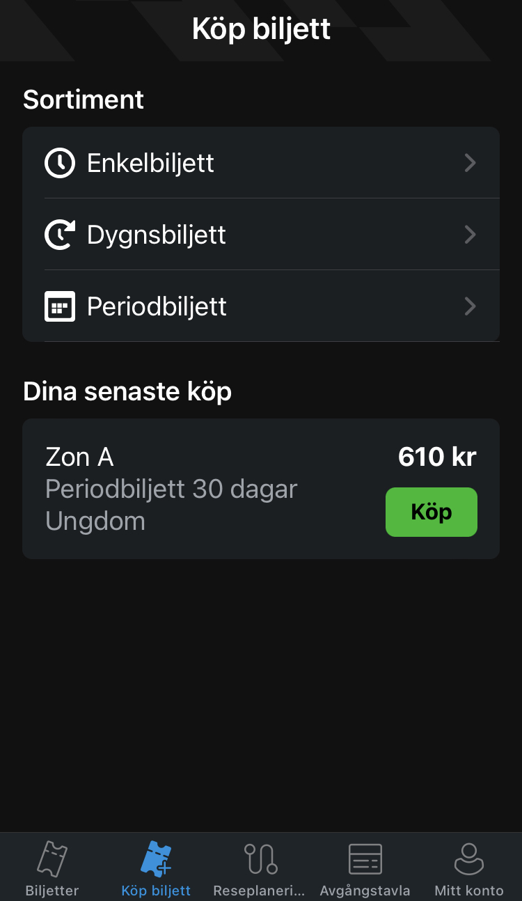
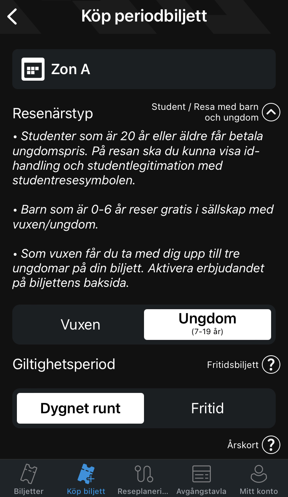

+++
title = "公共交通票"
description = "This page tells you how to get your public transportation ticket."
date = 2023-08-25T12:59:02.797Z
updated = 2023-08-25T12:59:02.797Z
draft = false
weight = 10
sort_by = "weight"
template = "docs/page.html"
+++

您需要一个叫 "Västtrafik To Go" 的 App 来买票。

您可以在第二页买票。

从上到下依次为：单次票，一日票，月票。

对于月票，如果您已经在 Mecenat 上验证了您的学生身份，您可以买学生票。

提示：您需要买全日票，"Fritid" 票学生不能买。

## Zones

如果您只是想乘公交车在校园、市中心附近活动，或是去宜家、去超市等，您只需要购买 Zone A 的车票即可。

一个常见的例外是，如果您想去机场，则需要购买包含 B 区的机票。

您可以随时在[此处](https://www.vasttrafik.se/reseplanering/hallplatser/)查看各个 Zone 的地图。
